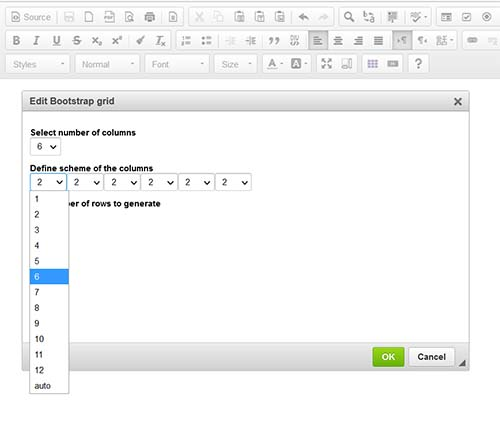

# Addition to Bootstrap 3 Grid widget for CKEditor 4
This is additions to  kaido24 btquicktable plugin for CKEditor 4 https://github.com/kaido24/btquicktable

 Original plugin  just generates equal-sized Bootstrap columns. This additions allows to define 'column scheme'  i.e.  size of each column, which in generated HTML goes to Bootstrap class as number in  col-md-X (col-md-3, col-md-2, col-md-auto)
 
 When number selected in Select number of columns, one or few dropdowns appear to select size for each column - Define scheme of the columns area:
 
 
 
 Error check added so that number of columns equal to 12 in case of only numbers and not exceed 12 when auto selected.
 
 Minor improvements in Add number of rows to generate: (1) it only allows to enter numbers, (2) the content get selected on focus.
                      
                      
-----              
# Original kaido24/btquicktable README:
# Bootstrap 3 Grid widget for CKEditor 4
Bootstrap grid widget for CKEditor >= 4.3
It depends on ckeditor widget plugin. http://ckeditor.com/addon/widget
It only works properly with bootstrap 3 enabled websites since otherwise it is just some html.
Demo video https://www.youtube.com/watch?v=Up7egPLxfdI

I do reccomend to use http://ckeditor.com/builder for non development purposes.

##Other Bootstrap 3 software for CKEditor 4

Bootstrap 3 Quicktable https://github.com/kaido24/btquicktable

Bootstrap 3 grid https://github.com/kaido24/bt_table

Bootstrap 3 link button https://github.com/kaido24/bt_link_btn
